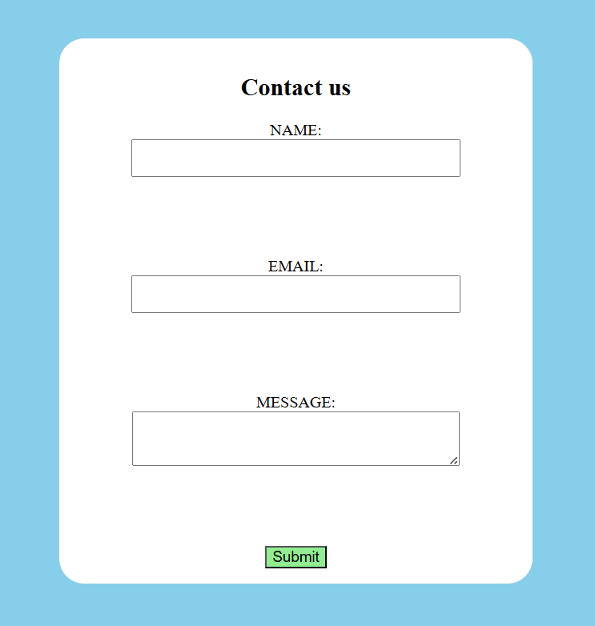

# 📬 Contact Form

A responsive and accessible contact form built using **HTML**, **CSS** . Designed for easy integration into any personal, portfolio, or business website.

---

## 🚀 Features

- ✅ HTML5 form validation  
- 💡 Clean and modern UI  
- 🧠 Accessible with proper labels  
- 📱 Fully responsive layout  
- 🔒 Privacy-focused — no third-party trackers

---

## 📂 Project Structure

```
contact-form/
├── index.html
├── style.css
├── preview.png      # Optional screenshot
└── README.md
```

---

## 🔧 Setup

1. **Clone the repository**
   ```bash
   git clone https://github.com/satwika-akula06/contact-form.git
   ```

2. **Open the form**
   - Open `index.html` in your browser to view it.

3. **Customize**
   - Edit the form fields or styles in `style.css`.

---

## 📸 Preview

### 🖼️ Image  



> _Note: GitHub does not support direct playback of `.mp4` files. Host it externally if needed._

---

## 🌐 Deployment

You can deploy this contact form on:

- GitHub Pages  
- Netlify  
- Vercel  
- Firebase Hosting  

Just upload your files or connect your GitHub repository.


